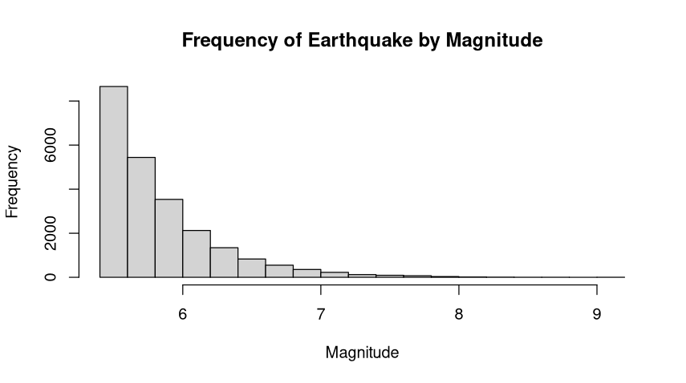

# MAT327-Project_APolanco
The interested of this project is the Global Earthquake Database because earthquakes are unexpected but important natural events. Studying where, how often, and how strong they are can give useful information about earthquake patterns. This can also help with understanding risks and being ready for disasters, which makes it a valuable topic to explore. I found the dataset on the website KAGGLE https://www.kaggle.com/datasets/usgs/earthquake-database. The dataset is owned by the US Geological Survey, an organization that studies and monitors seismic activities. The data is from 1965 to 2016. On this dataset there is information about the data, time, location, and magnitude of each of the occurring earthquakes.

Qualitative Data Column: Location (Country and/or city where the earthquake occurs.)

Quantitative Data Column: Magnitude (Intensive of the earthquake), and Depth (depth in km at which the earthquake occurs.)

