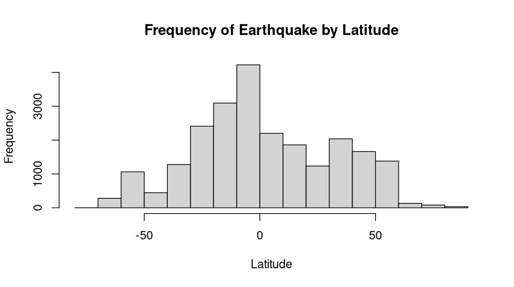

# MAT327-Project_APolanco
The interested of this project is the Global Earthquake Database because earthquakes are unexpected but important natural events. Studying where, how often, and how strong they are can give useful information about earthquake patterns. This can also help with understanding risks and being ready for disasters, which makes it a valuable topic to explore. I found the dataset on the website KAGGLE https://www.kaggle.com/datasets/usgs/earthquake-database. The dataset is owned by the US Geological Survey, an organization that studies and monitors seismic activities. The data is from 1965 to 2016. On this dataset there is information about the data, time, location, and magnitude of each of the occurring earthquakes.

Qualitative Data Column: Location (Country and/or city where the earthquake occurs.)

Quantitative Data Column: Magnitude (Intensive of the earthquake), and Depth (depth in km at which the earthquake occurs.)

From the graph “Frequency of Earthquakes by Magnitude”, the distribution of earthquake frequencies by magnitude right-skewed. From this graph, it can be derives that most of the earthquakes occur with magnitudes between 5 and 6, and as the magnitude increases, the frequency of earthquakes drops off significantly. There are very few earthquakes with magnitudes above 7, and even fewer approaching magnitude 9.
This decline in the number of higher magnitude earthquakes suggests that stronger earthquakes are relatively rare compared to lower magnitude ones. This can lead us to conclude that the smaller earthquakes occur more frequently, while the more destructive with higher magnitude earthquakes are less common.

From the graph “Frequency of Earthquakes by Latitude” it can be observe that the earthquake frequency by latitude, the distribution is approximately symmetric. The highest frequency of earthquakes occurring near the center of the latitude range (around 0 degrees), and the frequencies gradually decrease as it move away from the middle, both toward the positive and negative latitudes. 
Based on the information obtained from this graph, it can be conclude that the earthquakes activities are more concentrated in regions closer to the middle latitudes, with fewer earthquakes occurring as you move toward higher (positive) or lower (negative) latitudes.

From the graph “Frequency of Earthquake by Depth” it can be notice that the vast majority of earthquakes occur at very low depths, with a large skew around zero depth. This implies that most of the earthquakes happen close to the Earth's surface. Based on this information, it can be concluded that as the depth increases, the frequency of earthquakes drops dramatically, creating a heavily right-skewed distribution. In addition, it can be observe that very few earthquakes occur at depths greater than 200kms, and even fewer at depths greater than 400kms, which indicates that deeper earthquakes are much less common. Finally, it can be conclude that it doesn't appear to be any extreme outliers.

