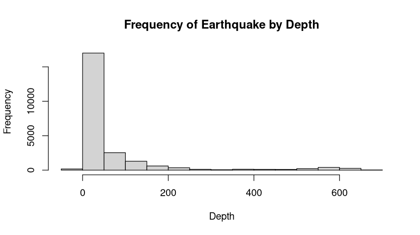

# Earthquake Database Analysis
  
The interested of this project is the Global Earthquake Database because earthquakes are unexpected but important natural events. Studying where, how often, and how strong they are can give useful information about earthquake patterns. This can also help with understanding risks and being ready for disasters, which makes it a valuable topic to explore. I found the dataset on the website KAGGLE https://www.kaggle.com/datasets/usgs/earthquake-database. The dataset is owned by the US Geological Survey, an organization that studies and monitors seismic activities. The data is from 1965 to 2016. On this dataset there is information about the date, time, location, and magnitude of each of the occurring earthquakes.

Qualitative Data Column: Location (Country and/or city where the earthquake occurs.)

Quantitative Data Column: Magnitude (Intensive of the earthquake), and Depth (depth in km at which the earthquake occurs.)

## Variable Distributions

### Earthquake Magnitude

From the graph “Frequency of Earthquakes by Magnitude”, the distribution of earthquake frequencies by magnitude right-skewed. From this graph, it can be derives that most of the earthquakes occur with magnitudes between 5 and 6, and as the magnitude increases, the frequency of earthquakes drops off significantly. There are very few earthquakes with magnitudes above 7, and even fewer approaching magnitude 9.
This decline in the number of higher magnitude earthquakes suggests that stronger earthquakes are relatively rare compared to lower magnitude ones. This can lead us to conclude that the smaller earthquakes occur more frequently, while the more destructive with higher magnitude earthquakes are less common.

### Earthquake Latitude

From the graph “Frequency of Earthquakes by Latitude” it can be observe that the earthquake frequency by latitude, the distribution is approximately symmetric. The highest frequency of earthquakes occurring near the center of the latitude range (around 0 degrees), and the frequencies gradually decrease as it move away from the middle, both toward the positive and negative latitudes. 
Based on the information obtained from this graph, it can be conclude that the earthquakes activities are more concentrated in regions closer to the middle latitudes, with fewer earthquakes occurring as you move toward higher (positive) or lower (negative) latitudes.

### Earthquake Depth

From the graph “Frequency of Earthquake by Depth” it can be notice that the vast majority of earthquakes occur at very low depths, with a large skew around zero depth. This implies that most of the earthquakes happen close to the Earth's surface. Based on this information, it can be concluded that as the depth increases, the frequency of earthquakes drops dramatically, creating a heavily right-skewed distribution. In addition, it can be observe that very few earthquakes occur at depths greater than 200kms, and even fewer at depths greater than 400kms, which indicates that deeper earthquakes are much less common. Finally, it can be conclude that it doesn't appear to be any extreme outliers.

### Earthquake Longitude

From the graph "Frecuency of Earthquakes by Longitude", the distribution of earthquake frecuencies by longitude have two major peaks, therefore it has a bimodal shape. This indicates that earthquakes are more frequent around two separate longitude ranges. The x-axis represents longitude values, ranging from approximately -180 to 180 degrees. It can be observed that one peak is centered between -180 and -150 degrees longitude, while the other is centered around 150 and 180 degrees longitude. The y-axis indicates the frequency of earthquakes observed at each longitude interval. The data graph shows that the distribution is not assymetrical, meaning there is more frequency activity at the ends than near the center. 

## Outliers Presented on Earthquake Database

To the analysis of the Earthquake database, the data choose to study have being the magnitude, longitude, latitude, and depth of recorded earthquake. However, from the analysis of the presented histograms, it have been concluded that the recorded data for the Depth of the earthquake present a high peak at the left of the graph, which indicates the presence of some outliers that might result in the alterating of the statical measures of the center. Therefore, when performing the require measures calculations, it will also be calculated the **Trimmed Mean** to present the comparision on how the outliers have been altering the overall central tendency for the Depth data.

On the above image "The Frequency of Earthquake by Depth with Trimmed Mean", the distribution of earthquake depths is displayed. Also, it can be observed a vertical red dashed line which represent the data that will be excluded from the analysis, in order to reduce the impact of this extreme values on the mean.

## Measure of Center and Spread of Earthquake Database

In analysis of the Earthquake Database, we will look at the statistical measures such as the mean, trimmed mean, median, variance, and standard deviation, on the columns of the Earthquake Database like Magnitude and Depth. 

### Statistical Measures of the Magnitude Column

- **Mean** = 5.88
* **Median** = 5.7
+ **Variance** = 0.1789
- **Standard Deviation** = 0.4231

From the obtained calculations we can observed that the mean ***5.88*** and the median ***5.7*** of the magnitude values are close to each other. This suggest that the distribution of the magnitudes is symmetrical with only slight skewness. However, as it is illustrated in the histogram graph "Frequency of Earthquake by Magnitude" the distribution is right-skewed.

The variance ***0.1789***, and the standard deviation ***0.4231*** are very low, which suggest that the values don't vary widely from the mean. 

### Statistical Measures of the Depth Column

- **Mean** = 70.77
* **Trimmed Mean** = 39.113
+ **Median** = 33
- **Variance** = 15043.49
* **Standard Deviation** = 122.65

From the obtained calculations we can observed that the mean ***70.77***, and the median ***33*** of the depth values, which suggest a right skewed distribution. Since the obtained mean is farther apart from the median, the trimmed mean was calculated to remove the 10% of the extreme data from the end. The calculated trimmed mean ***39.113*** shows a closer value to the median, which indicates that the outliers on the end were highly influenty on the mean. Therefore, removing the ends, give a better representation of the usual depth of the earthquakes.

The variance ***15043.49*** and the standard deviation ***122.65*** indicate a high degree of variability, which suggest that the depth values are spread widely from the mean. 
